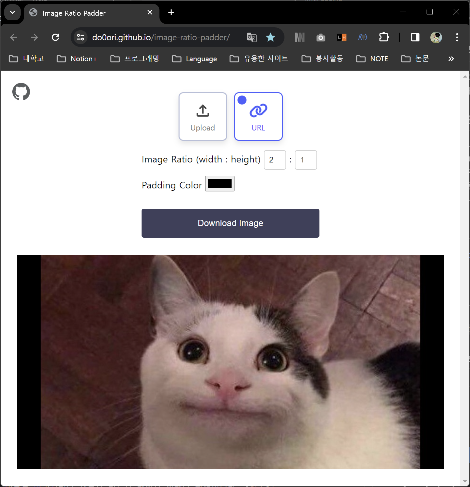

# 🖼️Image Ratio Padder
사용자가 이미지, 이미지 비율, 색상을 입력하면 해당 이미지의 원본 크기를 유지하되 입력 받은 이미지 비율에 맞게 나머지 부분을 입력한 색상으로 채워주는 웹 애플리케이션입니다.

## Motivation Behind the Project
velog에 매일 TIL을 작성하고 있는데 thumbnail 잘림이 거슬려서 만들게 되었습니다. velog thumbnail 이미지 비율(1.91:1)에 맞지 않는 이미지를 업로드하면 강제로 화면을 채우게 되면서 thumbnail 이미지가 잘려서 보이게 됩니다.
초기에는 간단하게 [google colab에 python으로 코드를 작성](https://colab.research.google.com/drive/1IagwBSuHEUcfWeuASyWGF61sLjHKUKwK#scrollTo=Fua4pold15aP)해서 사용했었는데 웹에서 사용할 수 있도록 하는 편이 접근성이나 활용도가 높을 것 같아 프로젝트를 시작하게 되었습니다.

## Usage
🔗[Image Ratio Padder 바로가기](https://do0ori.github.io/image-ratio-padder/)

1. 이미지를 장치에서 업로드 할 것인지 URL을 사용할 것인지 선택하여 이미지 업로드합니다.
2. 이미지의 가로, 세로 비율, 채워질 때 사용될 (배경) 색상을 선택하면 이미지에 즉시 반영됩니다.
3. `Download Image` 버튼으로 처리된 이미지를 다운로드할 수 있습니다.

## Key Features
- 원본 크기에서 확장하는 방식으로 이미지 비율을 맞춥니다.
- 사용자가 지정한 색상으로 확장된 부분을 채웁니다.

## Technology Stack

    
    
    

## Contributions
버그를 발견하거나 새로운 기능을 제안은 언제나 환영입니다! [이슈](https://github.com/do0ori/image-ratio-padder/issues)를 작성해주세요.